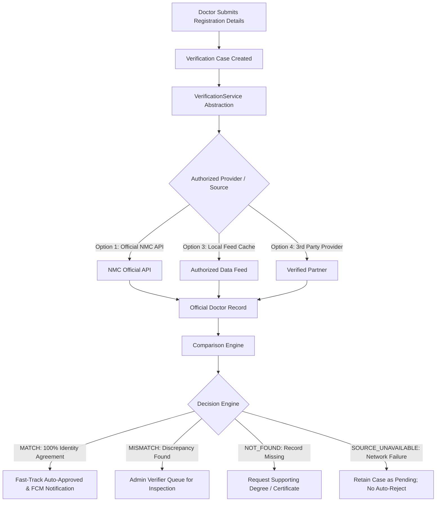

# Medical Registration Verification: Alternative Approaches & Hybrid Architecture

## 1. Core Principle & Purpose
The Medical Council (National Medical Commission - NMC and State Medical Councils) remains the sole authoritative source of truth for doctor registrations. The Healthcare Workforce Platform validates credentials by obtaining official registration data through an authorized mechanism and comparing it with the information submitted by the doctor.

---

## 2. Analysis of Alternative Verification Approaches

| Approach | Implementation Option | Reliability | Operational Difficulty | Recommendation |
| :--- | :--- | :--- | :--- | :--- |
| **Option 1** | **Official NMC / SMC API** | Very High | Medium | **Preferred Production Method** when authorized API access is established. |
| **Option 2** | **Authorized Search Infrastructure Access** | High | Medium–High | Viable where formal API is undocumented but machine-readable access is formally authorized. |
| **Option 3** | **Authorized Data Feed & Synchronized Database** | Very High | High | Excellent for scale; requires strict sync frequency and data provenance monitoring. |
| **Option 4** | **Third-Party Verification Provider** | High | Low–Medium | Practical interim solution provided data privacy, council coverage, and legal compliance are vetted. |
| **Option 5** | **Automated Browser RPA** | Low–Medium | High | **Forbidden for normal production**. Fragile to UI changes, CAPTCHAs, and lacks formal authorization. |
| **Option 6** | **Digitally Verifiable Credentials (QR/PKI)** | Very High | Medium | Excellent where issuing authorities embed cryptographic signatures into digital certificates. |
| **Option 8** | **Recommended Hybrid Architecture** | **Very High** | **Medium** | **Selected Platform Standard**. Combines automated provider checks with a human-in-the-loop exception queue. |

---

## 3. Recommended Hybrid Architecture Specifications

### 3.1 Supported Structured Outcomes
The Verification Engine emits one of six deterministic outcomes:
1. `MATCH`: All required identity fields (Full Name, Registration Number, Council, Primary Qualification) and active council registration status agree. Case is approved via fast-track policy.
2. `MISMATCH`: Discrepancy detected between submitted details and official registry (e.g. name variance, qualification mismatch, suspended/expired license). Case routed to the Admin Verifier Queue.
3. `NOT_FOUND`: Registration number is absent from official register. Doctor is prompted to upload original certificate; case queued for human verifier investigation.
4. `SOURCE_UNAVAILABLE`: Medical council or provider API is temporarily unreachable. **Doctor is NOT auto-rejected**; case is retained in reviewable/retry state.
5. `MANUAL_REVIEW_REQUIRED`: Ambiguous or fuzzy match results requiring human verification.
6. `VERIFICATION_ERROR`: System/infrastructure error during check execution.

### 3.2 Audit Trail Requirements
Every verification check creates an immutable audit document in `verificationChecks` containing:
- `source`: Provider ID / authority queried
- `registrationNumber`: Target registration ID
- `council`: Target state/national council
- `submittedFields`: Full name, qualification, council, registration number
- `officialFields`: Complete authoritative record returned by source
- `comparedFields`: Field-by-field array with match booleans
- `mismatchDetails`: String summary of any discrepancies
- `automatedResult`: Canonical outcome enum
- `confidenceScore`: Integer score (0–100)
- `checkedAt`: Timestamp
- `actorId`: Triggering user ID or system daemon

---

## 4. Division of Responsibilities: Firebase vs. Supabase

The platform follows a **Firebase-First Architecture**:

| Capability | Canonical Backend | Role & Invariants |
| :--- | :--- | :--- |
| **Authentication** | **Firebase Authentication** | Phone OTP provider, session management, and custom claims (`doctor`, `hospital`, `verifier`, `admin`, `super_admin`). |
| **Primary Database** | **Cloud Firestore** | Canonical store for users, doctors, organizations, facilities, duties, applications, assignments, and audit logs. |
| **Privileged Business Logic** | **Cloud Functions v2** | State transitions, double-booking prevention, atomic selection, verification decision recording, outbox worker. |
| **Evidence Document Storage** | **Cloud Storage for Firebase** | Zero public download URLs. Private vault with 5-minute short-lived server-signed read URLs. |
| **Notifications** | **Firebase Cloud Messaging** | Asynchronous delivery via transactional `notificationOutbox` collection with leases and retries. |
| **Abuse Protection** | **Firebase App Check** | Attestation enforcement protecting backend APIs from unauthorized automated abuse. |
| **Master Configuration** | **Firestore & Remote Config** | Centralized 12-hour offer expiry duration, platform feature flags, and version policies. |
| **Auxiliary Data Feeds (Optional)** | **Supabase (Isolated)** | Restricted strictly to isolated external medical registration caches or read-only queries where PostgreSQL indexing is specifically advantageous. **No duplication of core platform state.** |

---

## 5. Security & Compliance Invariants
1. **Client is Never Authorization Authority**: The Flutter app and Admin Web portal are untrusted clients. All sensitive mutations execute via Cloud Functions.
2. **No Public URLs for Medical Evidence**: `getDownloadURL()` is forbidden. Medical certificates and hospital licenses require short-lived, authenticated server-signed URLs.
3. **No Secrets in Client Binaries**: NMC API keys, Firebase Admin credentials, and third-party master tokens exist exclusively server-side in Cloud Secret Manager.
4. **Step-Up Verification for Admins**: Verifiers and administrators performing sensitive state changes must possess recently authenticated sessions (max age 10 minutes) and verified custom claims.

---

## 6. Phased Scaling Strategy
The platform scales gradually without premature microservice fragmentation:
1. **Database Tier**:
   - Composite Firestore indexes on high-frequency marketplace query fields (`status`, `specialtyName`, `geoHash`, `startAt`).
   - Server-validated cursor pagination for duty listings and applicant queues.
2. **Asynchronous Decoupling**:
   - Transactional `notificationOutbox` pattern decouples push notification delivery from critical path database transactions.
3. **Caching**:
   - Client-side and edge caching for master data (medical council lists, specialties, public organization branding).
4. **Evolution Path**:
   - Start with modular Cloud Functions v2 and managed Firestore.
   - Deconstruct only high-throughput endpoints (e.g. real-time duty geo-search) into dedicated Cloud Run microservices when production telemetry demonstrates the requirement.
