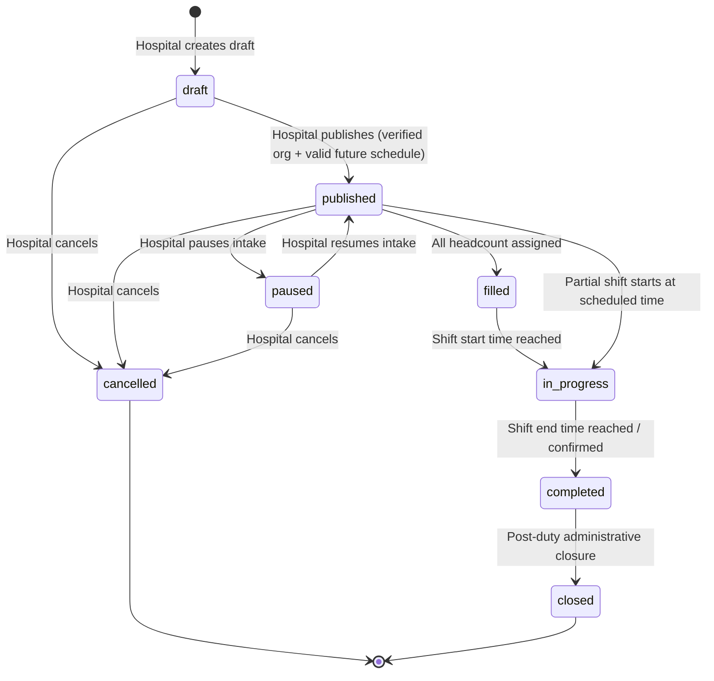
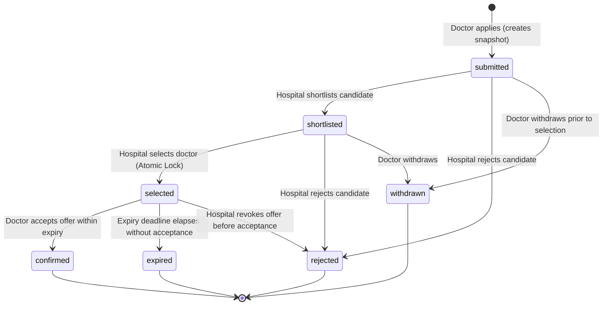
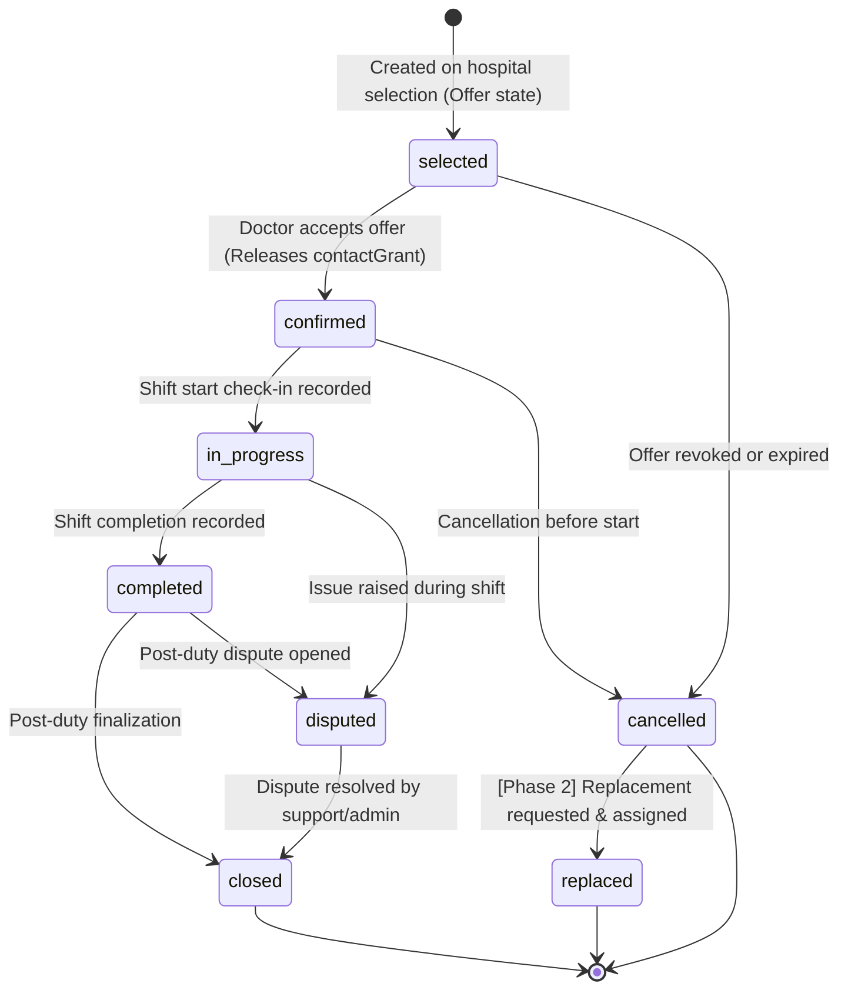
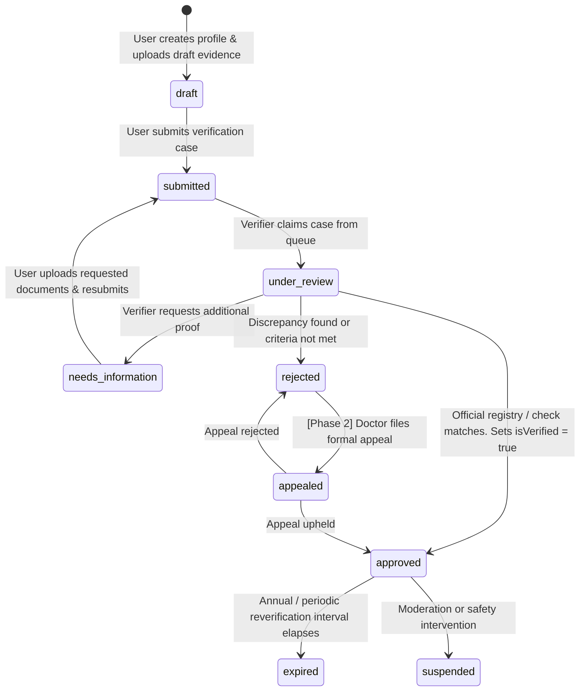

# Platform State Machines & Lifecycle Invariants

This document establishes the canonical state machines for the Healthcare Workforce Platform. Every transition is strictly enforced server-side inside Cloud Functions.

---

## 1. Duty Lifecycle State Machine

A Duty represents a hospital's demand for healthcare workforce staffing. It is completely independent of individual applicant assignments.

### Duty Transitions & Guards
| From | Action | To | Guard / Actor |
| :--- | :--- | :--- | :--- |
| `draft` | `publish` | `published` | Hospital staff with active org membership; org is `approved`; `startAt` is in the future; `headcount > 0`. |
| `published` | `pause` | `paused` | Hospital staff pauses applications temporarily. |
| `paused` | `resume` | `published` | Hospital staff resumes intake. |
| `published` | `assign_headcount` | `filled` | Remaining headcount reaches `0`. |
| `published` / `filled` | `start_shift` | `in_progress` | Time policy or manual start by hospital coordinator. |
| `in_progress` | `complete_shift` | `completed` | Shift ends. Attendance and completion recorded. **Feedback and payment ack are non-blocking optional post-duty workflows.** |
| `completed` | `close_duty` | `closed` | Final closure. |
| `draft` / `published` / `paused` | `cancel_duty` | `cancelled` | Hospital cancels with reason code. Notifies active applicants. |

---

## 2. Doctor Application State Machine

An Application represents a doctor's expression of interest in a specific duty. It is uniquely keyed by `dutyId + doctorId`.

### Application Transitions & Guards
| From | Action | To | Guard / Actor |
| :--- | :--- | :--- | :--- |
| `[*]` | `apply` | `submitted` | Doctor is verified; duty is `published` with `remainingHeadcount > 0`; no prior active application for this duty. Creates immutable `applicationSnapshots`. |
| `submitted` | `shortlist` | `shortlisted` | Hospital staff belonging to duty's organization. |
| `submitted` / `shortlisted` | `reject` | `rejected` | Hospital staff with rejection category. |
| `submitted` / `shortlisted` | `withdraw` | `withdrawn` | Doctor withdraws before selection. |
| `submitted` / `shortlisted` | `select` | `selected` | Hospital staff selects candidate inside `atomicSelectDoctor` transaction. Creates assignment offer with `expiresAt`. |
| `selected` | `confirm` | `confirmed` | Doctor accepts offer before `expiresAt`. |
| `selected` | `expire` | `expired` | Expiry deadline reached without doctor confirmation. Releases headcount back to duty. |

---

## 3. Assignment Lifecycle State Machine

An Assignment represents the contractual execution of a duty by a specific confirmed doctor.

### Assignment Transitions & Guards
| From | Action | To | Guard / Actor |
| :--- | :--- | :--- | :--- |
| `selected` | `accept_offer` | `confirmed` | Selected doctor accepts before `expiresAt`. Creates active `contactGrants` for both sides. |
| `selected` | `decline_or_expire` | `cancelled` | Doctor declines or offer expires. Headcount restored on duty. |
| `confirmed` | `start_shift` | `in_progress` | Doctor check-in or hospital coordinator handoff. |
| `in_progress` | `complete_shift` | `completed` | Attendance verified, shift finish recorded. |
| `completed` | `close` | `closed` | Assignment closed. Optional feedback/payment acknowledgement recorded. |
| Any active | `raise_dispute` | `disputed` | Either party opens a formal dispute with evidence. |

---

## 4. Doctor & Organization Verification State Machine

