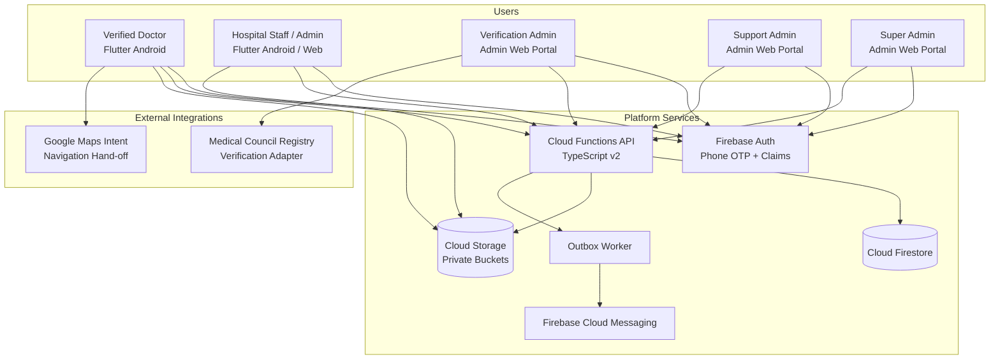

# System Overview & Context Architecture

## 1. Executive Summary
The **Healthcare Workforce Platform** (`com.geerthan.healthcareworkforce`) is a mobile-first, permissioned, auditable marketplace connecting verified healthcare professionals (doctors) with verified healthcare facilities (hospitals and clinics). It replaces unstructured, unsafe communication channels (WhatsApp/Telegram groups) with a robust, structured digital system ensuring verified identities, atomic shift selections, double-booking prevention, auditable contact disclosures, and operational trust.

---

## 2. System Context & Boundaries

---

## 3. Core Architectural Tenets
1. **Vertical Slice Implementation**: Every domain capability is built vertically with typed presentation, state notifier / view model, domain entities, remote repository, Cloud Function, Firestore rules, and automated tests.
2. **Strict Privacy Minimization**: Direct phone numbers and personal emails are never exposed on public marketplace cards. They are resolved on-demand via authenticated server functions only after a confirmed assignment and active contact grant exist.
3. **Immutability of Historical Facts**: Application snapshots, duty terms snapshots, assignment event streams, and audit logs are append-only and never overwritten when user profiles change.
4. **Resilient Offline UX**: The Flutter client employs Riverpod and optimistic cache projections for low latency, but server functions always validate canonical state for all mutations.
