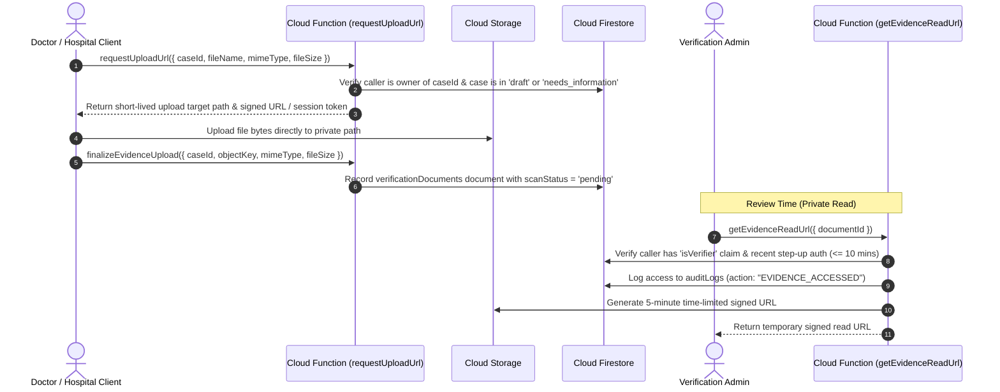

# Cloud Storage Security & Private Evidence Architecture

## 1. Private Bucket Taxonomy & Storage Rules

Permanent public URLs (`getDownloadURL()`) are **strictly prohibited** for all sensitive evidence.

```
/
├── verification/
│   ├── doctor/
│   │   └── {doctorUid}/
│   │       └── {caseId}/
│   │           └── {opaqueFileId}          # Doctor registration certificate & identity proof
│   └── organization/
│       └── {orgId}/
│           └── {caseId}/
│               └── {opaqueFileId}          # Hospital establishment license & authorized rep proof
│
├── disputes/
│   └── {disputeId}/
│       └── {opaqueFileId}                  # Dispute evidence photos / documents
│
└── public/
    └── branding/
        └── {orgId}/
            └── logo.png                    # Public hospital logos (cache-controlled)
```

---

## 2. Secure Upload & Review Workflow



---

## 3. Storage Security Rules Enforcement
- **MIME Types Allowed:** `image/jpeg`, `image/png`, `application/pdf`.
- **Max File Size:** $10\text{ MB}$ ($10 \times 1024 \times 1024$ bytes).
- **Ownership Check:** Direct writes enforce `request.auth.uid == doctorUid` or active membership in `orgId`.
- **Direct Reads:** All root verification folders disallow unauthenticated and cross-user direct client reads (`allow read: if false;`). Authorized reads go through the server-signed URL function.
